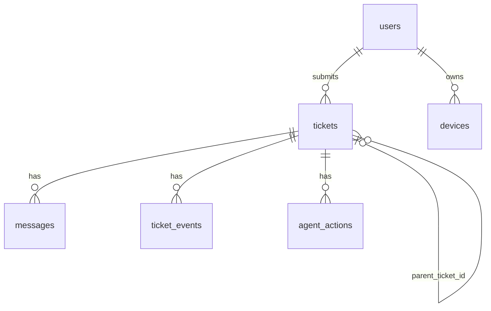

# AI IT Helpdesk Agent -- Phase 1 + 2 + 3 + 4 + 5A + 5B + 7

Phase 1: **project foundation + database layer** (`claudeprompt/phase1.md`).
Phase 2: **FastAPI CRUD API on top of that database** (`claudeprompt/phase2.md`).
Phase 3: **the IT Admin Dashboard frontend** (`claudeprompt/phase3.md`).
Phase 4: **email integration** (`claudeprompt/phase4.md`).
Phase 5A: **AWS infrastructure for inbound email ingestion** (`claudeprompt/phase5.md`) --
infrastructure-as-code only, not deployed by this session (see that section).
Phase 5B (file named `phase6.md`): **ticket/email-thread processing polish** --
ticket numbers, a reopen-on-reply policy change, and message subject history.
Phase 7: **RAG knowledge base and retrieval** (`claudeprompt/phase7.md`, see
the "Phase 7" section near the end of this file, and the full manual at
`docs/rag-manual/`) -- knowledge ingestion (PDF/TXT/MD/DOCX -> chunks ->
embeddings), pgvector similarity search, and a retrieval evaluation
harness. Still no AI agent, chat generation, or automatic ticket actions --
this phase only makes "what does IT documentation say about X" answerable;
nothing yet decides or responds on its own.

## 1. Architecture

```
Next.js (frontend/)  --HTTP-->  FastAPI (backend/)  --raw SQL-->  PostgreSQL
```

Clean separation, one direction of dependency: the frontend never talks to
the database directly, and the backend never renders HTML. This phase wires
up the bottom two layers (FastAPI + Postgres) for real; the frontend is a
placeholder page so the folder structure exists before the dashboard
(project.md #2-3) is built in a later phase.

**No ORM.** The backend talks to Postgres with plain SQL strings through
`psycopg2` -- no SQLAlchemy, no autogenerated queries. That's a deliberate
choice for this project, not a limitation: every SQL statement the app runs
is readable in the file that executes it.

Inside the backend, each concern still gets its own layer so a grad-student
reader (or a future contributor) always knows where to look:

| Folder | Purpose |
|---|---|
| `app/config.py` | Reads `DATABASE_URL` etc. from environment variables. |
| `app/database.py` | psycopg2 connection pool + `get_db()` dependency. |
| `app/enums.py` | Python enums mirroring the CHECK constraints in the schema (validation + autocomplete). |
| `app/schemas/` | Pydantic classes -- the shape of data returned over HTTP. |
| `app/routers/` | FastAPI route handlers. Thin -- just call a service and return it. |
| `app/services/` | The actual SQL. Every query lives here, returning plain dicts. |
| `migrations/` | Plain numbered `.sql` files + a small runner script -- the only way the schema is created/changed. |
| `seed/` | Demo data script (raw `INSERT` statements). |
| `tests/` | pytest suite, runs against a real Postgres. |

## 2. Table purposes and relationships



| Table | Purpose |
|---|---|
| `users` | Students/employees who email IT. No login -- identified by email only. |
| `tickets` | One IT issue per user. Central object everything else hangs off of. |
| `messages` | Every inbound/outbound piece of a ticket's conversation (email threading headers included). |
| `ticket_events` | Append-only audit trail of what changed on a ticket (status transitions, etc.). |
| `agent_actions` | The AI's audit trail: what tool it called, why, and the result -- populated later, structure exists now. |
| `knowledge_documents` | Metadata for IT documentation (title, status, version). |
| `knowledge_chunks` | Phase 7: one row per chunk of a `knowledge_documents` row, holding its `vector(1024)` embedding. |
| `devices` | Hardware associated with a user, for the AI to inspect later. |

Foreign keys: `tickets.user_id -> users.id`, `messages.ticket_id -> tickets.id`,
`ticket_events.ticket_id -> tickets.id`, `agent_actions.ticket_id -> tickets.id`,
`devices.user_id -> users.id`, `tickets.parent_ticket_id -> tickets.id`.

## 3. Design decisions changed from the spec (with reasons)

1. **No `admins` table -- as instructed, here's the issue and the resolution.**
   `tickets.assigned_admin_id` (and similarly `messages`/`ticket_events`
   actor references, `knowledge_documents.uploaded_by`) need *something* to
   point at, but Phase 1 explicitly excludes an admins table and
   authentication. Resolution: these are stored as plain `UUID` columns
   **without a foreign key constraint**. This keeps every column phase1.md
   asked for, with no name/shape changes needed once an `admins` table is
   added in a later phase (the FK gets added onto the same column).
2. **Enums are CHECK-constrained `VARCHAR`, not native Postgres `ENUM` types**,
   for `category`, `priority`, `status`, `resolution_source`, `closed_reason`,
   `sender_type`, `direction`. Adding a new value to a native PG enum needs
   `ALTER TYPE ... ADD VALUE` (awkward transactional rules); adding one here
   is an ordinary migration that drops and re-adds a CHECK constraint.
3. **`ticket_events.event_type`, `agent_actions.action_type`/`tool_name`/`status`
   stay as plain indexed strings, not enums.** These describe an
   open-ended, fast-growing taxonomy (new AI tools, new event types) that
   later phases will keep adding to -- an enum here would mean a migration
   every time.
4. **No ORM.** Originally scaffolded with SQLAlchemy; switched to raw
   `psycopg2` SQL by request. `app/services/` holds every SQL statement,
   returning plain dicts (via `RealDictCursor`) straight to the router --
   there's no `app/models/` object layer in between. Migrations moved from
   Alembic to plain `.sql` files + `migrations/run_migrations.py`, since
   Alembic's main value (autogenerating migrations from ORM model changes)
   doesn't apply without an ORM.
5. **No `app/models/` dataclass layer either.** It was scaffolded initially
   (one `@dataclass` per table) but removed: nothing in Phase 1 does
   anything with a row except hand it straight to a Pydantic schema, so the
   dataclasses were pure boilerplate with zero payoff. Pydantic validates
   the raw dict a service returns directly (e.g. coercing the string
   `"STUDENT"` into `UserRole.STUDENT`). If a later phase's agent logic
   starts manipulating rows outside of a request/response cycle, typed
   objects become worth reintroducing -- but not before there's an actual
   use for them.
6. **`updated_at` auto-updates via a Postgres trigger** (`set_updated_at()`
   in `migrations/0001_initial_schema.sql`), not application code. Postgres
   has no built-in `ON UPDATE CURRENT_TIMESTAMP` (unlike MySQL); a trigger
   is the standard way to get the same behavior without every service
   function having to remember to set it.
7. **Users are never hard-deleted** (`migrations/0003_restrict_user_deletion.sql`
   changed `tickets.user_id`/`devices.user_id` from `ON DELETE CASCADE` to
   `ON DELETE RESTRICT`). The AI depends on historical ticket data surviving
   indefinitely (project.md #7-8 -- recognizing recurring issues and similar
   past resolutions); deleting a user would cascade-delete their entire
   ticket history along with them. Nothing in the API deletes users today,
   so this was previously safe "by accident" -- RESTRICT makes Postgres
   actively refuse it instead. The correct way to remove a user from active
   use is to deactivate them (`UPDATE users SET account_status = 'DISABLED'`),
   which touches nothing else. If a real privacy/retention policy ever
   requires erasing personal data, the right operation is to anonymize the
   PII columns on the `users` row in place (email, name, department,
   employee_or_student_id) while keeping the row itself, so every
   `tickets.user_id`/`devices.user_id` foreign key still resolves and
   ticket history stays intact. Neither a deactivate nor an anonymize
   endpoint exists yet -- there's no admin user-management feature calling
   for them yet, so building them now would be speculative.

## 4. Files created

```
backend/
  app/
    config.py, database.py, main.py, enums.py
    schemas/       user.py, ticket.py, message.py, ticket_event.py,
                    agent_action.py, knowledge_document.py, device.py
    routers/       health.py, users.py, tickets.py
    services/      user_service.py, ticket_service.py   (raw SQL lives here)
  migrations/      0001_initial_schema.sql, 0002_add_admins_table.sql,
                   0003_restrict_user_deletion.sql, run_migrations.py
  seed/            seed_data.py
  tests/           conftest.py, test_health.py, test_models.py, test_seed.py
  requirements.txt, requirements-dev.txt, pytest.ini, .env.example

frontend/
  src/app/         layout.tsx, page.tsx   (placeholder -- no dashboard yet)
  src/lib/api.ts, src/types/index.ts
  package.json, tsconfig.json, next.config.js, .env.example

docker-compose.yml   (Postgres w/ pgvector extension, for later RAG phase)

infra/
  README.md   (reserved for AWS CDK infrastructure code in a later phase)

.github/workflows/
  backend-ci.yml    (spins up Postgres, runs the migration runner + pytest)
  frontend-ci.yml   (npm install, lint, build)
```

## 5. Commands to run the project

```bash
# 1. Start Postgres
docker compose up -d

# 2. Backend
cd backend
python3 -m venv .venv && source .venv/bin/activate
pip install -r requirements-dev.txt
cp .env.example .env                          # defaults already match docker-compose.yml
python -m migrations.run_migrations           # create the 7 tables
python -m seed.seed_data                      # insert demo data
uvicorn app.main:app --reload                 # http://localhost:8000

# 3. Frontend (optional for this phase -- placeholder page only)
cd ../frontend
npm install
cp .env.example .env.local
npm run dev                                   # http://localhost:3000
```

## 6. How to verify the database works

```bash
cd backend && source .venv/bin/activate

# Schema + FK/unique constraints
pytest -v

# API round-trip
curl http://localhost:8000/health          # {"status":"ok","database":"connected"}
curl http://localhost:8000/users           # John Smith
curl http://localhost:8000/tickets         # 3 tickets: open, closed, and one linked via parent_ticket_id
```

All of the above was run against a real Postgres container during this
implementation (both the original SQLAlchemy version and the current raw-SQL
rewrite): migration applied cleanly, seed script inserted 1 user / 3 tickets
/ 4 messages / 3 ticket_events / 2 agent_actions, all 5 pytest tests passed,
and `/health`, `/users`, `/tickets` all returned correct data. The frontend
(`npm run build`) also compiles successfully.

## 7. Data flow (this phase)

```
python -m migrations.run_migrations  -->  runs 0001_initial_schema.sql, creates 7 tables
python -m seed.seed_data             -->  raw INSERT statements populate demo data
uvicorn app.main:app                 -->  FastAPI app starts, app/database.py opens a connection pool
GET /tickets  -->  router (app/routers/tickets.py)
              -->  service (app/services/ticket_service.py) runs "SELECT * FROM tickets ..."
              -->  each row comes back as a plain dict (via RealDictCursor)
              -->  Pydantic schema (app/schemas/ticket.py) validates + serializes it to JSON
              -->  response
```

Nothing here talks to an LLM, email provider, or vector store yet.

---

## Phase 2: the API layer

Reuses the Phase 1 database and migrations unchanged -- Phase 2 adds write
endpoints, validation, and pagination on top.

### API structure

```
app/errors.py            NotFoundError / ConflictError -- raised by services,
                          mapped to 404/409 by one exception handler in main.py
app/schemas/pagination.py  Page[T] -- {"items", "total", "limit", "offset"}
app/services/
  user_service.py          + find_or_create_user, list_tickets_for_user, list_devices_for_user
  ticket_service.py        + create/update/status/assign/related/history, TRANSITIONS graph
  ticket_event_service.py  (new) list + log_event (called by ticket_service on every mutation)
  message_service.py       (new) list + create (derives `direction` from `sender_type`)
  agent_action_service.py  (new) list only -- nothing writes these until the AI agent exists
app/routers/
  users.py, tickets.py     (extended)
  messages.py, ticket_events.py, agent_actions.py   (new, nested under /tickets/{id}/...)
```

### Endpoint list

| Method | Path | Notes |
|---|---|---|
| POST | `/users` | Find-or-create by email. 201 if created, 200 if found. |
| GET | `/users` | List all. |
| GET | `/users/{id}` | 404 if missing. |
| GET | `/users/{id}/tickets` | Paginated. |
| GET | `/users/{id}/devices` | |
| POST | `/tickets` | Validates `user_id` (and `parent_ticket_id` if given) exist -> 404 if not. |
| GET | `/tickets` | Paginated. |
| GET | `/tickets/{id}` | |
| PATCH | `/tickets/{id}` | General fields only (not status/assignment/parent). |
| PATCH | `/tickets/{id}/status` | Validated against the transition graph below -> 409 if invalid. Logs a `ticket_events` row. |
| PATCH | `/tickets/{id}/assign` | Logs a `ticket_events` row. No FK check possible -- still no `admins` table. |
| GET | `/tickets/{id}/related` | `{"parent": Ticket \| null, "children": [Ticket]}` |
| GET | `/tickets/{id}/history` | Messages + events + agent_actions merged, sorted by `created_at`. |
| GET | `/tickets/{id}/messages` | Paginated. |
| POST | `/tickets/{id}/messages` | `sender_type` + `body` only; `direction` and `sender_id` rules are enforced automatically. |
| GET | `/tickets/{id}/events` | Paginated, read-only. |
| GET | `/tickets/{id}/agent-actions` | Paginated, read-only. |

Ticket status transition graph (enforced in `app/services/ticket_service.py`'s
`TRANSITIONS` dict):

```
NEW               -> AI_INVESTIGATING, ESCALATED
AI_INVESTIGATING  -> WAITING_FOR_USER, WAITING_FOR_ADMIN, RESOLVED, ESCALATED
WAITING_FOR_USER  -> AI_INVESTIGATING, IN_PROGRESS
WAITING_FOR_ADMIN -> IN_PROGRESS, RESOLVED, ESCALATED
IN_PROGRESS       -> WAITING_FOR_USER, WAITING_FOR_ADMIN, RESOLVED
RESOLVED          -> CLOSED, AI_INVESTIGATING (reopened)
ESCALATED         -> IN_PROGRESS, WAITING_FOR_ADMIN, RESOLVED
CLOSED            -> (terminal)
```

### Example requests/responses

```bash
# Find-or-create a user (201 first time, 200 after)
curl -X POST localhost:8000/users -H 'Content-Type: application/json' \
  -d '{"email":"jane@university.edu","name":"Jane Doe"}'
# -> 201 {"id":"...","email":"jane@university.edu","name":"Jane Doe","role":"STUDENT",...}

# Create a ticket
curl -X POST localhost:8000/tickets -H 'Content-Type: application/json' \
  -d '{"user_id":"<id>","subject":"VPN broken","description":"...","category":"VPN"}'
# -> 201 {"id":"...","status":"NEW",...}

# Invalid status jump
curl -X PATCH localhost:8000/tickets/<id>/status -H 'Content-Type: application/json' \
  -d '{"status":"CLOSED"}'
# -> 409 {"detail":"cannot transition ticket from NEW to CLOSED"}

# Paginated list
curl "localhost:8000/tickets?limit=1&offset=0"
# -> 200 {"items":[{...}],"total":3,"limit":1,"offset":0}
```

### Files changed in Phase 2

New: `app/errors.py`, `app/schemas/pagination.py`, `app/services/ticket_event_service.py`,
`app/services/message_service.py`, `app/services/agent_action_service.py`,
`app/routers/messages.py`, `app/routers/ticket_events.py`, `app/routers/agent_actions.py`,
`tests/test_users_api.py`, `tests/test_tickets_api.py`, `tests/test_messages_api.py`,
`tests/test_events_and_actions_api.py`.

Modified: `app/schemas/user.py` (+`UserCreate`), `app/schemas/ticket.py`
(+`TicketCreate`/`TicketUpdate`/`TicketStatusUpdate`/`TicketAssign`/`TicketRelated`/`TicketHistoryEntry`),
`app/schemas/message.py` (+`MessageCreate` with a cross-field validator),
`app/services/user_service.py`, `app/services/ticket_service.py`,
`app/routers/users.py`, `app/routers/tickets.py`, `app/main.py`.

### How to run

Same as Phase 1 (see above) -- nothing new to install beyond what's already
in `requirements.txt`. Once `uvicorn app.main:app --reload` is running,
interactive API docs are at `http://localhost:8000/docs`.

### How to test

```bash
cd backend && source .venv/bin/activate
pytest -v   # 26 tests: Phase 1's schema/seed tests + Phase 2's API tests
```

All of the above (migrations, seed, every endpoint above, all 26 pytest
tests) was run against a real Postgres container during implementation.

---

## Phase 3: the admin dashboard

### 1. Files created/modified

**Backend additions** (still no AI/email -- see `claudeprompt/phase3.md`'s
explicit exclusions):
- `migrations/0002_add_admins_table.sql` -- the `admins` table Phase 1
  deferred, plus the FK it unblocks on `tickets.assigned_admin_id`.
- `app/schemas/admin.py`, `app/services/admin_service.py`, `app/routers/admins.py`
  -- read-only admin directory (`GET /admins`).
- `app/schemas/dashboard.py`, `app/services/dashboard_service.py`, `app/routers/dashboard.py`
  -- the 7 stat cards in one call (`GET /dashboard/stats`).
- `app/schemas/ticket.py` (+`changed_by_admin_id` on `TicketStatusUpdate`),
  `app/schemas/message.py` (relaxed: `sender_id` now allowed for `ADMIN` too),
  `app/schemas/user.py` (+`UserWithTicketCount`).
- `app/services/ticket_service.py` (`list_tickets` gains filters; `assign_ticket`
  now FK-validates and logs `actor_type=ADMIN`), `app/services/message_service.py`
  (validates an `ADMIN` `sender_id` against `admins`), `app/services/user_service.py`
  (+`list_users_with_ticket_count`).
- `app/routers/tickets.py` (filter query params), `app/routers/users.py`
  (list endpoint uses the ticket-count query), `app/main.py` (CORS middleware
  + the two new routers).
- `seed/seed_data.py` -- 2 demo admins, one assigned to the seeded ticket.
- Tests: `tests/test_admins_and_dashboard_api.py` (new), plus additions to
  `tests/test_tickets_api.py` and `tests/test_users_api.py`.

**Frontend** (all new -- Phase 1 only scaffolded a placeholder page):
```
frontend/src/
  types/index.ts              TS types mirroring every backend schema
  lib/api/client.ts            fetch wrapper + typed ApiError + query-string helper
  lib/api/{tickets,users,admins,dashboard}.ts   one function per backend call
  lib/ActingAdminContext.tsx   the "Acting as" identity stand-in (see below)
  app/globals.css              hand-rolled design system (tokens, badges, tables, cards)
  app/layout.tsx               app shell: Sidebar + Topbar + ActingAdminProvider
  app/page.tsx                 redirects to /dashboard
  app/dashboard/page.tsx
  app/tickets/page.tsx         search + filters + pagination
  app/tickets/[id]/page.tsx    conversation, status, assignment, history, AI activity
  app/users/page.tsx
  app/users/[id]/page.tsx
  app/knowledge-base/page.tsx, app/analytics/page.tsx   placeholders
  components/layout/{Sidebar,Topbar}.tsx
  components/common/{StatCard,States}.tsx
  components/tickets/{Badges,TicketTable,MessageBubble,TicketConversation,TicketHistory,AIActivity}.tsx
  components/users/{UserTable,UserTicketList,DeviceList}.tsx
```

### 2. Frontend architecture

Every page is a Client Component (`"use client"`) fetching directly from
FastAPI via `lib/api/*` -- no Next.js server proxy, no Server Components
for data loading. One fetching model everywhere, at the cost of requiring
CORS on the backend (`app/main.py`) for `localhost:3000`/`3001`.

No Tailwind or UI library was added -- `app/globals.css` is a small,
hand-written set of tokens and classes (badges keyed by `data-status`/
`data-priority` attributes, tables, cards, a timeline). Kept the dependency
list unchanged from Phase 1.

### 3. The "Acting as" admin -- Phase 3's stand-in for login

There's still no authentication. `admins` exist now (Phase 3 added the
table), but nothing logs in as one. `ActingAdminContext` (React context +
localStorage) lets you pick a name from the Topbar dropdown; that id is
then sent along as "me" for the dashboard's "Tickets Assigned to Me" card
and to attribute status changes to a specific admin
(`TicketStatusUpdate.changed_by_admin_id`). It is never a credential and
gates nothing -- picking a different name any time is fine.

Two small things built beyond phase3.md's literal wording, both flagged
during planning and chosen with recommended defaults: the status/priority
filter options use the real enum values (`NEW`/`AI_INVESTIGATING`, `URGENT`)
rather than the spec's `OPEN`/`CRITICAL`, which don't exist in the schema;
and an "Assign Ticket" control was added to the ticket detail page (not
explicitly requested in phase3.md's page-4 layout) so the assignment
feature the backend already had is actually reachable from the UI.

### 4. Pages and what each fetches

| Page | Data fetched |
|---|---|
| `/dashboard` | `GET /dashboard/stats`, `GET /tickets?limit=5`, `GET /users`, `GET /admins` |
| `/tickets` | `GET /tickets` with filter/search/pagination params, `GET /users`, `GET /admins` (for name lookups) |
| `/tickets/[id]` | `GET /tickets/{id}`, `GET /users/{user_id}`, `GET /tickets/{id}/messages`, `.../events`, `.../agent-actions`, `.../related`, `GET /users/{user_id}/devices`, `GET /admins` |
| `/users` | `GET /users` (includes `ticket_count`) |
| `/users/[id]` | `GET /users/{id}`, `GET /users/{id}/tickets`, `GET /users/{id}/devices` |

### 5. How to run

```bash
# Backend (see Phase 1/2 setup above) -- from backend/, with the venv active:
uvicorn app.main:app --reload --port 8000

# Frontend
cd frontend
npm install
npm run dev            # http://localhost:3000 (or 3001 if 3000 is taken)
```

If the frontend lands on a port other than 3000/3001, add it to
`allow_origins` in `app/main.py`'s `CORSMiddleware`.

### 6. How to test

Backend: `pytest -v` (33 tests). Frontend: `npm run build` (type-checks +
lints); no frontend test framework was added since phase3.md's testing
section (#15) is a manual verification checklist, not automated tests.
Verified manually during implementation: every page route (200, no
server-side crash), every endpoint each page calls (correct data via curl),
the CORS preflight for a PATCH request from the dashboard's actual origin,
and the exact write payloads (send reply, change status, assign) the UI
constructs -- all against a real running Postgres + FastAPI + Next.js stack,
not mocked.

### 7. Data flow

```
Admin clicks "Update" on a status dropdown
  --> Next.js (lib/api/tickets.ts: updateTicketStatus)
  --> FastAPI (PATCH /tickets/{id}/status)
  --> validates the transition against TRANSITIONS, updates the row,
      logs a ticket_events row
  --> PostgreSQL
  --> FastAPI serializes the updated Ticket via Pydantic
  --> Next.js updates React state with the response
  --> Admin sees the new status badge, no page reload
```

### 8. How a ticket detail page gets its information

```
Ticket (GET /tickets/{id})
├── User            (GET /users/{ticket.user_id})
├── Messages        (GET /tickets/{id}/messages)
├── Events          (GET /tickets/{id}/events)
├── AI Actions      (GET /tickets/{id}/agent-actions)
├── Related Ticket  (GET /tickets/{id}/related)
└── Devices through User  (GET /users/{ticket.user_id}/devices)
```
Six separate requests, fired together with `Promise.all` once the ticket
itself resolves (its `user_id` is needed first) -- not one combined
backend endpoint, since each already existed from Phase 2 and phase3.md's
rule #13 is that the frontend shouldn't need the backend reshaped just to
save round trips.

---

## Phase 4: email integration

### 1. Files created/modified

**New `app/email/` package** (the provider abstraction phase4.md calls the
most important separation in this phase):
- `models.py` -- `InboundEmail`, `SentEmail`, `InboundProcessResult`
- `provider.py` -- `EmailProvider` abstract base class, `EmailSendError`
- `dev_provider.py` -- `DevEmailProvider` (prints instead of sending; the default)
- `ses_provider.py` -- `AWSSESProvider` (boto3, `send_raw_email` for real header control)
- `parser.py` -- address normalization, ticket-id-from-subject extraction
- `threading.py` -- reply subject + References-header construction
- `service.py` -- `process_inbound_email()`, `send_admin_reply()`, `get_email_provider()`

**Other new files:** `app/routers/email.py` (`POST /email/inbound`),
`app/schemas/email.py`, `migrations/0004_messages_email_message_id_unique.sql`,
`tests/test_email_service.py`, `tests/test_email_inbound_api.py`.

**Modified:** `app/config.py` (+email settings), `app/main.py` (+router),
`app/schemas/message.py` (+`send_email` on `MessageCreate`, new
`SendMessageResult` response schema), `app/routers/messages.py` (send_email
handling, admin-only enforcement), `app/services/message_service.py`
(+`create_message_from_email`), `app/services/ticket_service.py`
(`create_ticket` now takes an optional actor so an email-created ticket
logs `TICKET_CREATED` as `STUDENT`, not `SYSTEM`), `requirements.txt`
(+boto3), `tests/test_messages_api.py` (updated for the new response shape
+ new send_email tests). **Frontend:** `lib/api/tickets.ts`
(`sendAdminMessage` signature + `SendMessageResult` type),
`components/tickets/TicketConversation.tsx` (+"send as email" checkbox,
non-fatal email-failure warning separate from hard errors).

### 2. Database migration changes

One migration: `0004_messages_email_message_id_unique.sql` adds a `UNIQUE`
constraint on `messages.email_message_id`. Every column phase4.md needed
(`email_message_id`, `in_reply_to`, `email_thread_id`) already existed from
Phase 1 -- this phase populates them for the first time rather than adding
new ones. No `delivery_status` column was added (see decision #4 below).

### 3. Email architecture

```
app/email/provider.py (EmailProvider ABC)
        ^                           ^
        |                           |
app/email/dev_provider.py    app/email/ses_provider.py
  (EMAIL_PROVIDER=dev,         (EMAIL_PROVIDER=ses,
   the default -- prints        real AWS SES via boto3,
   instead of sending)          not live-tested here)
```

`app/email/service.py` is the only module that combines this abstraction
with the existing Phase 2 services (`user_service`, `ticket_service`,
`message_service`, `ticket_event_service`) -- none of those services know
email exists. `EMAIL_PROVIDER=dev` is what this project actually runs
against: no AWS account exists in this environment, so `AWSSESProvider` is
implemented for real (boto3, MIME headers, `send_raw_email`) but has never
been exercised against a real AWS account here -- see decision #1 below.

### 4. Inbound email flow

```
POST /email/inbound
  -> idempotency check (email_message_id already seen? return "duplicate")
  -> normalize sender address, find-or-create user
  -> 5-strategy ticket matching (see #7 below)
  -> match found  -> apply WAITING_FOR_USER/RESOLVED transition if applicable
  -> no match     -> create a new ticket (category=OTHER, priority=MEDIUM)
  -> create the message (STUDENT/INBOUND, with email headers stored)
  -> log a ticket_event (TICKET_CREATED or USER_REPLIED)
```

### 5. Outbound email flow

```
Admin dashboard: reply box, "send as email" checked
  -> POST /tickets/{id}/messages {sender_type: ADMIN, body, send_email: true}
  -> reject with 400 if sender_type != ADMIN (send_email is admin-only)
  -> message_service.create_message() -- message row saved first, always
  -> email_service.send_admin_reply():
       - find the most recent prior email-bearing message on this ticket
       - build subject "Re: {ticket.subject} [Ticket {short_id}]"
       - provider.send_email(to, subject, body, in_reply_to, references)
       - success -> stamp email_message_id/in_reply_to/email_thread_id onto the message
       - failure -> log a ticket_events row (EMAIL_SEND_FAILED), message is kept as-is
  -> response: {"message": {...}, "email_sent": bool, "email_error": string|null}
```

### 6. Email threading strategy

`Message-ID`/`In-Reply-To`/`References` map directly onto
`messages.email_message_id`/`in_reply_to`/`email_thread_id` (the last one
holds the ticket's *first* message's own Message-ID, or the provider's
thread id if one exists -- carried forward unchanged on every later
message in that ticket, per Phase 1's original convention). `References`
isn't stored as its own column -- it's assembled at send time from every
`email_message_id` already recorded on the ticket
(`app/email/threading.py:build_references`).

### 7. Ticket matching strategy

Implemented in `app/email/service.py:_find_matching_ticket`, in priority
order exactly as phase4.md #12 specifies: `In-Reply-To` ->  `References` ->
provider `thread_id` -> `[Ticket <short-id>]` tag in the subject -> create
new. **One addition beyond the literal spec:** a candidate match is
discarded (falls through to "create new") if it belongs to a different
user than the identified sender -- otherwise a forged `In-Reply-To` or
subject tag could attach a message to a stranger's ticket. Verified live
(see the "spoofed reference" test in `test_email_service.py`).

### 8. Duplicate protection strategy

Checked *first*, before any user/ticket work happens: `SELECT ... WHERE
email_message_id = ...`. If found, return `"duplicate"` immediately -- no
new rows of any kind. The `UNIQUE` constraint from migration `0004` is the
authoritative backstop for a genuine race (two requests processing the
same `email_message_id` concurrently): the insert's `UniqueViolation` is
caught and treated identically.

### 9. Security considerations

- `/email/inbound` has no real caller-identity check by default
  (`EMAIL_WEBHOOK_DEV_MODE=true`). In any environment where real inbound
  email will reach this endpoint, set it to `false` and set
  `EMAIL_WEBHOOK_SECRET` -- the endpoint then requires a matching
  `X-Webhook-Secret` header. **This is an explicit stand-in for real
  SES/SNS message signature verification, not a substitute for it** -- no
  real SES/SNS is configured anywhere in this project to verify against.
- `send_email` is rejected with `400` unless `sender_type=ADMIN` -- a
  forged/STUDENT-sender request can never trigger an outbound email.
- Inbound email content is never executed or rendered as HTML -- it's
  stored and displayed as plain text throughout.
- AWS credentials live only in backend environment variables
  (`app/config.py`) -- never sent to or reachable from the frontend.
- Sender email address is never treated as strong identity for anything
  beyond "which STUDENT does this IT ticket belong to" -- no password
  resets, account changes, or privileged actions exist in this system.

### 10. Environment variables

```env
EMAIL_PROVIDER=dev            # "dev" (default, no AWS needed) or "ses"
IT_SUPPORT_EMAIL=it-support@university.edu
AWS_REGION=us-east-1
AWS_ACCESS_KEY_ID=
AWS_SECRET_ACCESS_KEY=
EMAIL_WEBHOOK_DEV_MODE=true    # false + EMAIL_WEBHOOK_SECRET in any real deployment
EMAIL_WEBHOOK_SECRET=
```

### 11. Local development instructions

No AWS account needed -- `EMAIL_PROVIDER=dev` (the default) prints every
outbound email to the backend's console instead of sending it, including
its fabricated Message-ID, so the whole threading/matching loop is fully
exercisable locally. Simulate an inbound email with:

```bash
curl -X POST localhost:8000/email/inbound -H 'Content-Type: application/json' -d '{
  "from": "student@university.edu",
  "to": "it-support@university.edu",
  "subject": "Cannot connect to WiFi",
  "body": "My laptop wont connect to the campus wifi.",
  "message_id": "<msg-1@gmail.com>"
}'
```

### 12. Test instructions

```bash
cd backend && source .venv/bin/activate
pytest -v   # 58 tests
```

### 13. Example inbound email payload

```json
{
  "from": "john@university.edu",
  "to": "it-support@university.edu",
  "subject": "Re: VPN Connection Problem [Ticket 9422325a]",
  "body": "I restarted my laptop but VPN still does not work.",
  "message_id": "<abc456@gmail.com>",
  "in_reply_to": "<abc123@university.edu>",
  "references": ["<abc123@university.edu>"],
  "thread_id": "provider-thread-id"
}
```

### 14. Example admin reply payload

```json
POST /tickets/{ticket_id}/messages
{
  "sender_type": "ADMIN",
  "body": "Please restart your laptop and try connecting to the VPN again.",
  "send_email": true
}
```

### 15. Example complete email conversation flow (verified live during implementation)

```
1. POST /email/inbound  (student, new ticket)       -> {"status": "created", "ticket_id": "a79c...", ...}
2. GET  /tickets/a79c...                             -> status: NEW, subject: "VPN Connection Problem"
3. POST /tickets/a79c.../messages (ADMIN, send_email) -> email_sent: true, Message-ID stamped,
                                                          In-Reply-To set to the student's original Message-ID
4. POST /email/inbound (student reply, In-Reply-To = the admin email's Message-ID)
                                                      -> {"status": "matched_existing", "ticket_id": "a79c...", ...}
5. GET  /tickets/a79c.../messages                    -> 3 messages: STUDENT INBOUND, ADMIN OUTBOUND, STUDENT INBOUND
```

### Important design decisions

1. **`EMAIL_PROVIDER=dev` alongside the real `AWSSESProvider`.** There's no
   AWS account in this environment. `AWSSESProvider` is implemented for
   real (boto3, `send_raw_email` with hand-built MIME headers so
   In-Reply-To/References can actually be set -- SES's simpler
   `send_email` API can't do that), but has never been run against a real
   AWS account here. `DevEmailProvider` is what every test and manual
   verification in this phase actually exercised.
2. **Ticket id in the email subject reuses the existing UUID's first 8
   characters** (`[Ticket 9422325a]`), matching the short id already shown
   throughout the dashboard, rather than adding a new sequential
   `ticket_number` column. This is explicitly a fallback matching strategy
   (#12) -- headers are checked first and are what nearly every reply
   actually matches on.
3. **A reply to a `CLOSED` ticket changes nothing about its status.** The
   message is still appended and a `USER_REPLIED` event still logged, but
   `CLOSED` remains terminal (consistent with the Phase 2 status-transition
   graph) -- an admin has to notice and decide, rather than the system
   guessing whether to reopen it or start a new one.
4. **No `delivery_status` column.** A failed send leaves
   `email_message_id` `NULL` on the message row (which was already saved
   regardless of the send outcome) and logs an `EMAIL_SEND_FAILED`
   `ticket_events` row with the error in `metadata` -- fully queryable via
   the existing History timeline. The API response also carries
   `email_sent`/`email_error` for immediate feedback. "Delivered" =
   message exists **and** `email_message_id` is set.
5. **A ticket-matching candidate is discarded if it belongs to a different
   user than the identified sender.** Not explicitly asked for in
   phase4.md, but a direct consequence of matching correctly: without it, a
   forged `In-Reply-To` or subject tag could attach a message to a
   stranger's ticket.
6. **`ticket_service.create_ticket()` gained an optional actor
   parameter** rather than having `app/email/service.py` log a second
   `TICKET_CREATED` event on top of the one `create_ticket()` already logs
   -- this was a real bug caught during live verification (two
   `TICKET_CREATED` events on the same ticket) and fixed before writing
   the automated tests.

---

## Phase 5A: AWS infrastructure for inbound email ingestion

**Not deployed.** This session has no AWS credentials and was explicitly
asked not to deploy -- everything below is infrastructure-as-code (AWS
CDK, Python) plus the actual Lambda source, verified by running
`cdk synth` (produces real CloudFormation, needs no AWS account) and the
Lambda's own test suite (S3 mocked via `moto`) -- not by deploying
anything. See `infra/README.md` for the exact commands.

### 1. Files created

```
infra/cdk/
  app.py, cdk.json, requirements.txt
  stacks/email_stack.py          all AWS resources, described below

infra/lambda/email_ingestion/
  handler.py                     Lambda entry point
  email_parser.py                 .eml bytes -> NormalizedEmail (stdlib only)
  fastapi_client.py               HTTPS POST to FastAPI (stdlib only)
  models.py                       NormalizedEmail dataclass
  requirements-dev.txt            pytest + moto (test-only)
  pytest.ini
  tests/test_email_parser.py, test_handler.py   (15 tests, all passing)
```

### 2. Files modified

None in `backend/` or `frontend/` -- phase5.md explicitly says not to
redesign the existing application, and nothing about the existing
`POST /email/inbound` contract needed to change: the Lambda produces
exactly the JSON shape that endpoint already accepts (see
`backend/app/schemas/email.py:EmailInboundPayload`).

### 3. AWS resources created (by `cdk deploy`, when you run it)

| Resource | Purpose |
|---|---|
| S3 bucket | Stores raw `.eml` files under `emails/YYYY/MM/DD/...` (SES writes the exact key; this stack doesn't hard-code the date-prefixed name, SES generates it) |
| Lambda function (`it-helpdesk-email-ingestion`) | Downloads, parses, and forwards each inbound email |
| Secrets Manager secret | The shared `X-Webhook-Secret` value Lambda sends to FastAPI |
| SES receipt rule set + rule | Routes mail for `it_support_email` into the S3 bucket |
| (auto) IAM role, IAM policy, Lambda resource policy, S3 bucket policy | See #4 |

### 4. IAM permissions created

Three genuinely different permission concepts, easy to conflate --
phase5.md Part 5 asks for this distinction explicitly:

| Concept | What it controls | What this stack grants |
|---|---|---|
| **Lambda execution role** | What the Lambda itself is allowed to *do* when it runs | `logs:CreateLogGroup/CreateLogStream/PutLogEvents` (CDK's default `AWSLambdaBasicExecutionRole`, scoped to this function's own log group) + `s3:GetObject` scoped to `<bucket>/emails/*` only (hand-written policy statement, not the broader `bucket.grant_read()` helper) + `secretsmanager:GetSecretValue`/`DescribeSecret` scoped to the one secret |
| **Lambda resource-based policy** | Who is allowed to *invoke* this Lambda | `lambda:InvokeFunction` for principal `s3.amazonaws.com`, conditioned on `SourceArn`=this bucket's ARN and `SourceAccount`=this account -- added automatically by `bucket.add_event_notification(...)` |
| **S3 bucket policy** | Who is allowed to act *on the bucket itself* | `s3:PutObject` for principal `ses.amazonaws.com` (conditioned on `aws:Referer`=this account), scoped to `emails/*` -- added automatically by binding `ses_actions.S3(...)` inside the receipt rule, plus a deny-non-HTTPS statement from `enforce_ssl=True` |

Explicitly **not** granted, per phase5.md's constraints: `s3:PutObject`/`DeleteObject` for the Lambda, `AdministratorAccess` anywhere, public bucket access.

### 5. Environment variables

**Lambda** (set by the CDK stack itself, not by you):
```
FASTAPI_BASE_URL=https://your-deployed-fastapi.example.com   # from -c fastapi_base_url
INBOUND_EMAIL_SECRET_ARN=arn:aws:secretsmanager:...            # the stack's own secret
```
(`AWS_REGION` is Lambda-reserved -- CloudFormation rejects setting it explicitly; boto3 already resolves it from the runtime.)

**CDK context** (you provide at synth/deploy time -- see `infra/README.md`):
```
fastapi_base_url     # your deployed FastAPI's public HTTPS URL
it_support_email     # the address SES should route into this bucket
```

**FastAPI** (`backend/.env`, already existed from Phase 4 -- update once you deploy):
```
EMAIL_WEBHOOK_DEV_MODE=false
EMAIL_WEBHOOK_SECRET=<the value of the Secrets Manager secret this stack creates>
```

### 6. Deployment commands

See `infra/README.md` -- `cdk bootstrap` once per account/region, then
`cdk deploy` with the two context values, then one manual
`aws ses set-active-receipt-rule-set` call (CDK has no resource for
"activate this rule set" -- it's a plain API call, not a provisionable
resource).

### 7. Local testing instructions

**The Lambda code**, without any AWS account: `cd infra/lambda/email_ingestion
&& pytest -v` -- S3 is mocked with `moto`, the FastAPI call is
monkeypatched. 15 tests cover every scenario phase5.md Part 13 lists
(plain/HTML/multipart parsing, missing/multiple headers, malformed input,
S3 event parsing, FastAPI success/401/unreachable, and confirming the
Lambda does zero idempotency work of its own -- see #10 below).

**The full pipeline, without AWS at all:** since a Lambda deployed to AWS
cannot call your laptop's `localhost:8000`, testing the *actual* Lambda
against your *actual* FastAPI requires FastAPI to be reachable from the
internet (a real deployment, or a tunnel like `ngrok`/`cloudflared`
pointed at your local server) -- there's no way around that constraint.
For everyday development, `curl -X POST localhost:8000/email/inbound`
(exactly as documented in Phase 4) already exercises 100% of the same
FastAPI-side logic the Lambda would trigger -- the Lambda's only job is
producing that same JSON body from a raw email, which `test_email_parser.py`
already verifies thoroughly without needing the network round-trip at all.

### 8. AWS Console verification steps (once you deploy)

1. **S3** -- open the bucket named in the stack's `EmailBucketName` output; confirm "Block all public access" reads *On* and default encryption is enabled.
2. **Lambda** -- open `it-helpdesk-email-ingestion`; under Configuration -> Permissions, confirm the execution role's inline policy shows exactly `s3:GetObject` (resource ending `/emails/*`) and the two `secretsmanager:*` actions -- nothing broader.
3. **Lambda** -> Configuration -> Triggers -- confirm S3 is listed as a trigger, event type "All object create events", prefix `emails/`, suffix `.eml`.
4. **SES** -> Email receiving -> Rule sets -- confirm your rule set is marked **Active** (this is the manual step from #6) and the rule's action is "Deliver to S3 bucket."
5. **Secrets Manager** -- confirm the secret exists and note its value for `backend/.env`'s `EMAIL_WEBHOOK_SECRET`.

### 9. End-to-end test procedure (once deployed and SES identity is verified)

1. Send a real email to your verified `it_support_email` address.
2. **S3** -- within seconds, a new object appears under `emails/YYYY/MM/DD/`.
3. **CloudWatch Logs** (`/aws/lambda/it-helpdesk-email-ingestion`) -- a `processing_started` entry, then `parsed` (with `message_id`/`from_email`/`subject` -- never the body), then `fastapi_request_succeeded`.
4. **Dashboard** -- the ticket appears at `https://your-frontend/tickets/<id>`, exactly as in the Phase 4 walkthrough.
5. Reply from the dashboard -- confirm the student actually receives the email (this is the point where SES's sandbox/production status, from #10 below, actually matters).

### 10. Assumptions and limitations

- **SES identity/domain verification, DKIM, SPF, DMARC, and requesting SES
  production access are not code** -- they're AWS-account-level
  configuration (domain ownership proof, DNS records, an AWS Support
  request) that this stack cannot automate or fake with a placeholder
  domain. `infra/README.md`'s deploy command requires you to supply your
  own real, controlled `it_support_email`/domain.
- **SES receiving is only available in specific AWS regions** (e.g.
  `us-east-1`, `us-west-2`, `eu-west-1` at time of writing) -- deploy this
  stack to one of those, or SES receipt rules will fail to create.
- **A deployed rule set is not automatically active** -- see the manual
  `aws ses set-active-receipt-rule-set` step in #6; CDK has no resource
  for this.
- **The `BucketNotificationsHandler` Lambda and its `s3:PutBucketNotification`-on-`"*"`
  policy** you'll see in `cdk synth`'s output are AWS/CDK's own internal
  plumbing for wiring up S3 event notifications via a CloudFormation
  custom resource -- not code this project wrote, and not part of the
  runtime email-processing path (it only runs once, during deploy).
- **AWSSESProvider** (Phase 4, `backend/app/email/ses_provider.py`) still
  has never been exercised against a real AWS account, same as noted in
  the Phase 4 section -- this phase adds the *inbound* half of real SES
  usage but doesn't change that.

### Complete request flow (phase5.md Part 15)

```
1.  Student sends an email to it-support@your-domain.edu
       -> nothing AWS-specific yet; this is just SMTP delivery to a
          domain whose MX records point at SES.

2.  Amazon SES receives it
       -> SES is the mail server here; no permission check needed for
          this step, receiving mail is what a verified SES identity is
          configured to do.

3.  SES's receipt rule (this stack's "StoreInboundEmailInS3") runs
       -> matches on the recipient address (it_support_email);
          triggers because it's the one active rule set.

4.  SES stores the raw .eml in S3
       -> SES (principal ses.amazonaws.com) calls s3:PutObject.
          Permitted by: the bucket policy statement bound via
          ses_actions.S3(...) in email_stack.py, scoped to emails/*
          and this AWS account (aws:Referer condition).
          Data: the complete raw MIME message, byte-for-byte.
          Lives: s3://<bucket>/emails/YYYY/MM/DD/<ses-generated-key>.eml

5.  S3 raises an ObjectCreated event
       -> internal to S3/EventBridge-style notification delivery;
          no cross-account call yet.

6.  S3 invokes the Lambda
       -> S3 (principal s3.amazonaws.com) calls lambda:InvokeFunction.
          Permitted by: the Lambda resource-based policy statement
          added automatically by bucket.add_event_notification(...),
          scoped via SourceArn (this bucket) + SourceAccount.
          Data: an S3 event payload -- just {bucket, key}, not the
          email content itself.

7.  Lambda's execution role allows it to read that object
       -> this is a *different* policy from #6 -- the execution role
          (attached to the Lambda's own identity) grants s3:GetObject
          scoped to <bucket>/emails/*. Without this, step 8 would be
          denied even though step 6 already let the invocation happen.

8.  Lambda downloads the .eml
       -> handler.py calls s3_client.get_object(Bucket, Key).
          Data: the same raw MIME bytes SES wrote in step 4.
          Lives: briefly, in the Lambda's memory during this invocation.

9.  Lambda parses the email
       -> email_parser.py, stdlib `email` package only -- no network
          call, no permission needed beyond what already happened.

10. Lambda creates a normalized InboundEmail
       -> models.py:NormalizedEmail -- from_email, to_email, subject,
          body, message_id, in_reply_to, references, thread_id. Purely
          in-memory at this point.

11. Lambda authenticates with FastAPI
       -> fetches the shared secret via secretsmanager:GetSecretValue
          (permitted by the execution role, scoped to this one secret --
          same "role" category as #7, just a different resource type).

12. Lambda POSTs to /email/inbound
       -> Lambda calls FastAPI over HTTPS, with header
          X-Webhook-Secret: <the fetched secret>.
          Permitted by: nothing AWS-specific -- this is a plain internet
          HTTPS call: FastAPI's own check (app/routers/email.py's
          _verify_webhook_secret) is what actually authorizes it.
          Data: the normalized JSON body from step 10.

13. FastAPI identifies the user
       -> app/email/service.py:process_inbound_email ->
          user_service.find_or_create_user -- exactly the Phase 4 logic,
          completely unchanged.

14. FastAPI finds/creates the ticket
       -> the same 5-strategy matching from Phase 4
          (_find_matching_ticket), unchanged.

15. PostgreSQL stores the message/event
       -> the same message_service/ticket_event_service calls from
          Phase 4, unchanged. This is the point where the request
          becomes durable and visible on the dashboard.
```

Steps 1-12 are what this phase added. Steps 13-15 are Phase 4's existing
logic, completely untouched -- exactly the "do not redesign the existing
architecture" constraint phase5.md opens with.

---

## Phase 5B (`phase6.md`): ticket & email-thread processing polish

Most of this phase's "Main Objective" (identify user, match ticket, store
message, log events) was **already implemented in Phase 4** -- the matching
priority order in this phase's Part 6 is verbatim what
`app/email/service.py:_find_matching_ticket` already did. What follows is
what's actually new, plus two explicit, discussed policy changes.

### Two decisions that reverse earlier choices (discussed and approved)

1. **A reply to a CLOSED ticket now reopens it** (to `IN_PROGRESS`), instead
   of Phase 4's "leave it CLOSED, admin decides." Reasoning: a closed
   ticket isn't in anyone's active queue, so silently leaving it closed
   means an admin likely never sees the student's reply.
2. **A sequential `tickets.ticket_number`** (displayed `"T-104"`) was added,
   replacing Phase 4's UUID-prefix approach (`[Ticket 9422325a]`) in email
   subjects and the `/email/inbound` response. As a consequence, the
   subject-tag matching fallback (Part 6, strategy 4) is now an *exact*
   integer lookup instead of a `LIKE 'prefix%'` guess -- no more
   "astronomically unlikely to collide" caveat.

As a direct consequence of decision 1, **RESOLVED's reopen target also
changed** from `AI_INVESTIGATING` (Phase 4) to `IN_PROGRESS`, so both
reopen edges (`RESOLVED`→ and `CLOSED`→) land in the same state instead of
two different ones for what's conceptually the same event.

### 1. Files created

None -- every change extends an existing file. This phase is entirely
additive/modificative on top of Phase 4's `app/email/` package.

### 2. Files modified

`migrations/0005_ticket_number_and_message_subject.sql` (new file, but
listed here since it's the only actual schema change);
`app/services/ticket_service.py` (+`ticket_number` in `TRANSITIONS`,
+`get_ticket_by_number`, +`format_ticket_number`);
`app/services/message_service.py` (+`subject` param on
`create_message_from_email`); `app/schemas/ticket.py` (+`ticket_number` on
`TicketRead`); `app/schemas/message.py` (+`subject` on `MessageRead`);
`app/schemas/email.py` (`EmailInboundResult` restructured -- see #4);
`app/email/parser.py` (`extract_ticket_id_prefix` → `extract_ticket_number`,
now returns `int`); `app/email/threading.py` (`build_reply_subject` takes
`ticket_number: int` instead of a UUID); `app/email/models.py`
(`InboundProcessResult` gains `user_id`/`ticket_number`/`action`);
`app/email/service.py` (`_apply_reply_status_transition` now reopens
RESOLVED/CLOSED and logs a `REOPENED` event; subject-tag matching uses
`get_ticket_by_number`); `app/routers/email.py` (constructs the new
response shape). **Frontend:** `types/index.ts` (+`ticket_number` on
`Ticket`, +`subject` on `Message`), `TicketTable.tsx`,
`UserTicketList.tsx`, `tickets/[id]/page.tsx` (all three now display
`#T-{ticket_number}` instead of a truncated UUID).

### 3. Database changes

`migrations/0005_ticket_number_and_message_subject.sql`:
- `tickets.ticket_number INTEGER GENERATED ALWAYS AS IDENTITY`, `UNIQUE` --
  existing rows were backfilled automatically by Postgres.
- `messages.subject VARCHAR(998)`, nullable -- the *email's own* subject
  line (which can literally change across a thread, e.g. "VPN broken" →
  "Re: VPN broken"), preserved as historical data. `NULL` for
  dashboard-composed ADMIN messages that don't (yet) have a generated
  subject.

Part 16's other requirements were already satisfied before this phase and
needed no changes: `users.email UNIQUE` (Phase 1), `messages.email_message_id
UNIQUE` (Phase 4, migration 0004), the three foreign keys (Phase 1), and
"do not casually delete historical messages" (Phase 4/5, migration 0003's
`ON DELETE RESTRICT` on `tickets.user_id`/`devices.user_id` -- see that
section for the full reasoning). `messages.sender_user_id -> users.id` as a
hard FK, as phase6.md's Part 16 suggests, was **not** added: `sender_id` is
deliberately polymorphic (a user when `sender_type=STUDENT`, an admin when
`sender_type=ADMIN`) -- a single FK to `users` would be actively wrong for
admin-sent messages. This was already handled correctly in Phase 2/3;
phase6.md's suggested constraint is simpler than what the schema actually
needs.

### 4. API changes

`POST /email/inbound`'s response shape changed to match phase6.md Part 13's
exact examples:

```jsonc
// before (Phase 4)
{"status": "created" | "matched_existing" | "duplicate", "ticket_id": "...", "message_id": "..."}

// after (Phase 6)
{
  "status": "processed" | "already_processed",
  "action": "created_new_ticket" | "attached_to_existing_ticket" | "duplicate",
  "message_id": "...", "user_id": "...", "ticket_id": "...", "ticket_number": "T-104"
}
```
No other endpoint changed shape -- `TicketRead` gained one additive field
(`ticket_number`) and `MessageRead` gained one additive field (`subject`);
both are backward-compatible additions.

### 5. Ticket matching algorithm

Unchanged from Phase 4, and confirmed to already match phase6.md Part 6's
priority order exactly:
```
1. Duplicate email_message_id check   (idempotency -- handled before matching starts)
2. In-Reply-To -> messages.email_message_id
3. References (in order) -> messages.email_message_id
4. Provider thread_id -> messages.email_thread_id
5. [Ticket T-104] tag in the subject -> tickets.ticket_number (exact match, Phase 6)
6. No match -> create a new ticket
```
Plus one addition beyond the literal spec (both phases): a match is
discarded if the candidate ticket belongs to a different user than the
identified sender, to prevent a forged header/tag from cross-attaching a
message to a stranger's ticket.

### 6. Status transition rules

```
NEW               -> AI_INVESTIGATING, ESCALATED
AI_INVESTIGATING  -> WAITING_FOR_USER, WAITING_FOR_ADMIN, RESOLVED, ESCALATED
WAITING_FOR_USER  -> AI_INVESTIGATING, IN_PROGRESS
WAITING_FOR_ADMIN -> IN_PROGRESS, RESOLVED, ESCALATED
IN_PROGRESS       -> WAITING_FOR_USER, WAITING_FOR_ADMIN, RESOLVED
RESOLVED          -> CLOSED, IN_PROGRESS (reopen -- changed from AI_INVESTIGATING)
ESCALATED         -> IN_PROGRESS, WAITING_FOR_ADMIN, RESOLVED
CLOSED            -> IN_PROGRESS (reopen -- changed from terminal)
```
Student-reply-specific behavior (`app/email/service.py:_apply_reply_status_transition`),
matching phase6.md Part 8 case-by-case:
- **Case A/B** (anything not listed below): no automatic change.
- **Case C** (`WAITING_FOR_USER`): -> `IN_PROGRESS`. Not a reopen -- only a `STATUS_CHANGED` event.
- **Case D/E** (`RESOLVED` / `CLOSED`): -> `IN_PROGRESS`, plus a dedicated `REOPENED` event.

Our status names map conceptually onto phase6.md's suggested 5-value set
(`OPEN`≈`NEW`, the rest matching by name) -- kept our actual 8-value enum
rather than renaming it, per the same reasoning as Phase 3's `OPEN`/`NEW`
decision (see that section).

### 7. Message lifecycle

A message is created once and never updated except for one narrow case:
an ADMIN message's `email_message_id`/`in_reply_to`/`email_thread_id` get
filled in *after* creation, once `send_email=True` actually succeeds
(Phase 4's `send_admin_reply`) -- the row itself, its body, and its
`subject` are immutable from the moment they're written. Every
communication (student email, AI reply once it exists, admin reply,
whether sent by email or portal-only) becomes exactly one `messages` row;
none are ever deleted or overwritten (phase6.md Part 9/10).

### 8. Event lifecycle

Every meaningful ticket action logs a `ticket_events` row, several kinds
now in play: `TICKET_CREATED`, `STATUS_CHANGED`, `ASSIGNED`,
`USER_REPLIED`, `ADMIN_REPLIED`, `REOPENED` (new this phase),
`EMAIL_SEND_FAILED`. phase6.md's Part 11 suggests `MESSAGE_RECEIVED`/
`MESSAGE_SENT` as generic names -- our existing `USER_REPLIED`/
`ADMIN_REPLIED` already cover the same concept with more specific,
already-tested names, so they were kept rather than renamed working code.
`REOPENED` is logged *in addition to* the generic `STATUS_CHANGED` for the
two reopen edges specifically, so "this ticket came back from being
finished" is never just inferred from an old/new value pair.

### 9. Tests created

`tests/test_email_service.py`: rewrote the CLOSED-reply test (now asserts
reopening + a `REOPENED` event, not "stays CLOSED"), updated the
RESOLVED-reply test similarly, switched the subject-tag test to the
`ticket_number` format, and added: `test_existing_user_with_a_new_problem_gets_a_separate_ticket`,
`test_unrelated_email_with_the_same_subject_text_does_not_merge`. New
migration means the earlier `format_ticket_number`/`get_ticket_by_number`
paths are exercised by these too.
`tests/test_email_inbound_api.py`: updated every response-shape assertion
to the new `status`/`action`/`ticket_number` fields, added
`test_missing_message_id_is_handled_gracefully` and
`test_malformed_payload_returns_a_safe_validation_error` (both expect a
clean 422, per phase6.md Part 15). **63/63 tests passing.**

### 10. Example database records

```
tickets
  id=06ca51d5-...  ticket_number=4  subject="Cannot print documents"  status=IN_PROGRESS

messages (ticket_id=06ca51d5-...)
  STUDENT | subject="Cannot print documents"                    | "The library printer wont print..."
  STUDENT | subject="Re: Cannot print documents [Ticket T-4]"   | "It broke again, please help!"

ticket_events (ticket_id=06ca51d5-..., chronological)
  TICKET_CREATED   None -> NEW              Actor: STUDENT
  STATUS_CHANGED   NEW -> AI_INVESTIGATING  Actor: SYSTEM   (manual, via dashboard)
  STATUS_CHANGED   AI_INVESTIGATING -> RESOLVED             Actor: SYSTEM
  STATUS_CHANGED   RESOLVED -> CLOSED                       Actor: SYSTEM
  STATUS_CHANGED   CLOSED -> IN_PROGRESS                    Actor: SYSTEM
  REOPENED         CLOSED -> IN_PROGRESS                    Actor: STUDENT
  USER_REPLIED     (no old/new value)                       Actor: STUDENT
```
(Captured live during implementation -- see #12 for the exact commands.)

### 11. Example API requests/responses

```bash
# New ticket
curl -X POST localhost:8000/email/inbound -d '{"from":"student@university.edu",
  "to":"it-support@university.edu","subject":"Cannot print documents",
  "body":"...","message_id":"<phase6-1@gmail.com>"}'
# -> {"status":"processed","action":"created_new_ticket","message_id":"...",
#     "user_id":"...","ticket_id":"...","ticket_number":"T-4"}

# Reply to that same (now-CLOSED) ticket, using only the subject tag -- no headers
curl -X POST localhost:8000/email/inbound -d '{"from":"student@university.edu",
  "to":"it-support@university.edu","subject":"Re: Cannot print documents [Ticket T-4]",
  "body":"It broke again, please help!","message_id":"<phase6-2@gmail.com>"}'
# -> {"status":"processed","action":"attached_to_existing_ticket", ..., "ticket_number":"T-4"}
# (ticket status flips CLOSED -> IN_PROGRESS as a side effect; see #10 above)
```

### 12. End-to-end explanation

**Scenario 1 (new problem):** identical to Phase 4's flow --
`find_or_create_user` -> `_find_matching_ticket` returns `None` (nothing to
match) -> `create_ticket` (logs `TICKET_CREATED` as `STUDENT`) ->
`create_message_from_email` -> ticket starts at `NEW`.

**Scenario 2 (student replies):** `_find_matching_ticket` finds the ticket
via `In-Reply-To` -> `_apply_reply_status_transition` checks the current
status (Case A/B/C/D/E) -> message created on the *same* ticket -> a
`USER_REPLIED` event logged.

**Scenario 3 (reply after resolution/closure) -- this phase's actual
behavior change:** `_find_matching_ticket` finds the ticket (via header or,
as verified live, the `[Ticket T-4]` subject tag alone with zero headers)
-> status is `RESOLVED` or `CLOSED` -> `_apply_reply_status_transition`
calls `update_ticket_status(..., IN_PROGRESS)` *and* logs a dedicated
`REOPENED` event -> the new message is stored on the same ticket, now
active again instead of sitting unnoticed in a closed state.

All three were run for real against a live Postgres + FastAPI during
implementation, not just written and assumed -- see #10/#11 above for the
actual captured output.

---

## Phase 7: RAG knowledge base and retrieval

Implements `claudeprompt/phase7.md`: an internal IT knowledge base
(documents -> chunks -> embeddings) and vector similarity search, kept
deliberately separate from ticket history (phase7.md #2, #22) and
stopping before any AI-generated response (phase7.md #23). **The full
design writeup -- chunking tradeoffs, the embedding provider
abstraction, cosine similarity explained, the versioning/error-handling
design, a step-by-step local testing walkthrough, and the actual
Recall@K/Precision@K results from a real run -- lives in
[`docs/rag-manual/`](docs/rag-manual/), not here.** This section is the
same kind of short structural summary the other phase sections above
give; read the manual for the "why" behind each decision.

### Package structure

```
backend/
  app/
    rag/                        (new package -- everything RAG-specific)
      extraction.py              PDF/TXT/MD/DOCX -> plain text
      chunking.py                 text -> list[Chunk], boundary-aware
      storage.py                   uploaded file bytes -> local disk or S3
      vector_literal.py            Python list[float] <-> pgvector text literal
      context.py                   search results -> phase7.md #16's JSON shape
      ingestion_service.py         orchestrates all of the above end to end
      retrieval_service.py         query -> top-K chunks (pgvector `<=>`)
      eval.py                       Recall@K/Precision@K against a labeled dataset
      embeddings/
        provider.py                 EmbeddingProvider ABC + EmbeddingError
        dev_provider.py              deterministic hashing-trick embeddings (default)
        bedrock_provider.py          Amazon Titan Text Embeddings v2 via Bedrock
        service.py                    EmbeddingService + get_embedding_service()
    auth.py                       (new) require_admin -- see "Admin authorization" below
    schemas/
      knowledge_document.py       (extended: previous_version_id, error_message)
      knowledge_chunk.py           (new)
      knowledge_search.py          (new)
    routers/knowledge.py          (new) /admin/knowledge/*
  migrations/0006_knowledge_chunks_and_vector.sql
  seed/
    knowledge_docs/*.md            8 example IT documents (VPN, WiFi, Password
                                     Reset, Account Setup, Office, Network,
                                     Printer, Known Issues)
    seed_knowledge_base.py          ingests all 8 through the real pipeline
  scripts/evaluate_retrieval.py   CLI: prints the retrieval eval report
  tests/
    test_rag_chunking.py, test_rag_embeddings.py, test_rag_extraction.py,
    test_rag_ingestion.py, test_rag_retrieval.py, test_knowledge_api.py
docs/rag-manual/                  the full manual (see above)
```

### Endpoint list

| Method | Path | Notes |
|---|---|---|
| POST | `/admin/knowledge` | Multipart upload (file + title + description? + category? + replace_document_id?). Runs the full ingestion pipeline synchronously; returns the document (READY or FAILED). |
| GET | `/admin/knowledge` | Paginated; filters: `status`, `category`, `search` (title). |
| GET | `/admin/knowledge/{id}` | 404 if missing. |
| GET | `/admin/knowledge/{id}/chunks` | Paginated; never includes the raw embedding (phase7.md #18). |
| DELETE | `/admin/knowledge/{id}` | Archives by default (`status=ARCHIVED`); `?hard=true` permanently deletes the row + cascades its chunks. |
| POST | `/admin/knowledge/search` | `{query, top_k, category?}` -> raw results + phase7.md #16's RAG context shape. Admin-facing preview; a future AI agent calls `retrieval_service.search()` directly, in-process. |

Every endpoint depends on `require_admin` (`app/auth.py`) -- see "Admin
authorization" below.

### Design decisions worth calling out here (details in the manual)

1. **Chunking is boundary-aware, not fixed-character-count**: splits on
   paragraph/heading/bullet blocks first, packs whole blocks up to a
   configurable token budget, and only splits a single oversized block at
   sentence boundaries as a last resort. `RAG_CHUNK_SIZE_WORDS` /
   `RAG_CHUNK_OVERLAP_WORDS` (env vars) control size/overlap -- phase7.md
   #5 explicitly asks these not be hardcoded.
2. **Embedding provider is swappable** (phase7.md #6): `EMBEDDING_PROVIDER=dev`
   (default) uses a deterministic, credential-free hashing-trick
   bag-of-words embedding -- real enough that vector search and the eval
   dataset below produce genuine, non-mocked results. `EMBEDDING_PROVIDER=bedrock`
   calls Amazon Titan Text Embeddings v2.
3. **Vector storage is Postgres + pgvector**, not a separate vector
   database (phase7.md #7; the `pgvector/pgvector:pg16` image was already
   pinned in `docker-compose.yml` back in Phase 1 for exactly this). An
   HNSW index (`vector_cosine_ops`) backs `ORDER BY embedding <=> query_embedding`.
4. **Document versioning replaces, never destroys** (phase7.md #9): a
   re-upload with `replace_document_id` creates a new row
   (`version = old.version + 1`, `previous_version_id = old.id`); the old
   row flips to `ARCHIVED` only *after* the new one successfully reaches
   `READY`, so a failed re-ingestion never takes the working version
   offline.
5. **Admin authorization is a clearly-labeled stand-in, not real auth**
   (phase7.md #10/#18): there is no login anywhere in this codebase yet
   (see "Design decisions changed from the spec" item 1, above). `app/auth.py`'s
   `require_admin` trusts an `X-Admin-Id` header resolved against the real
   `admins` table -- good enough to test "non-admin users can't manage the
   knowledge base" (phase7.md #20) and to gate the endpoints today, but
   not a security boundary. Replacing it with real session/JWT auth later
   changes one function, not every router.
6. **Ingestion failures never leave a document half-ready** (phase7.md
   #19): a `SAVEPOINT` taken before extraction/chunking/embedding means a
   failure partway through (corrupt PDF, embedding API outage, a DB
   error) rolls back only the partial work and leaves the document row as
   `FAILED` with `error_message` set -- verified with a real corrupted-PDF
   upload and a monkeypatched embedding-provider failure (see
   `tests/test_rag_ingestion.py`), not just written and assumed.

### Verifying it works

```bash
cd backend && source .venv/bin/activate
python -m migrations.run_migrations       # adds knowledge_chunks + the vector extension
python -m seed.seed_data                  # creates an admin row (used as uploaded_by)
python -m seed.seed_knowledge_base        # ingests seed/knowledge_docs/*.md (8 documents)
python -m scripts.evaluate_retrieval      # Recall@K / Precision@K against the eval dataset
pytest tests/test_rag_chunking.py tests/test_rag_embeddings.py tests/test_rag_extraction.py \
       tests/test_rag_ingestion.py tests/test_rag_retrieval.py tests/test_knowledge_api.py -v
```

All of the above was run against a real Postgres+pgvector container during
this implementation: all 8 example documents ingested to `READY`, the eval
script reported **100% Recall@1/@3/@5** across its 10 labeled questions
against that seeded corpus (see `docs/rag-manual` for the full report and
what Precision@K looked like on the same run), and the full pytest suite
(120 tests: the pre-existing Phase 1-6 suite plus this phase's new tests)
passed. See `docs/rag-manual`'s testing chapter for a complete manual
walkthrough (curl examples for every endpoint, including the
error-handling and versioning edge cases above).

---

Not moving to RAG/AI agent work automatically, per phase6.md.
