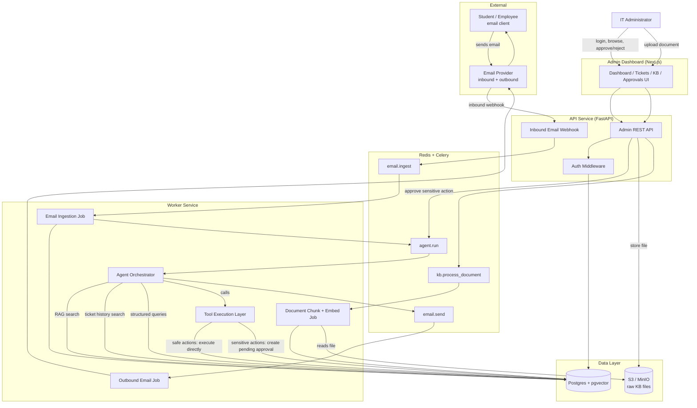
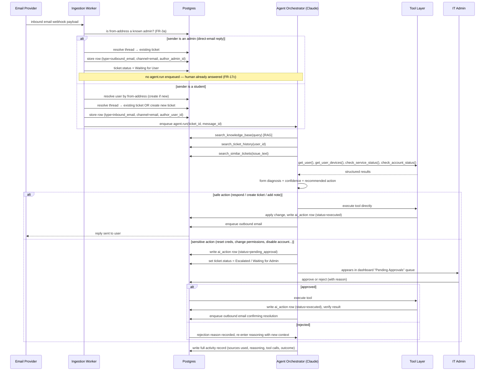
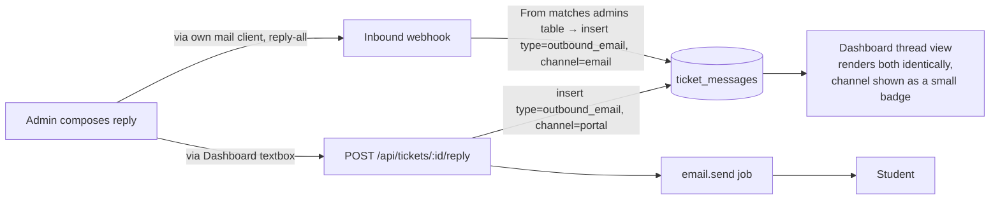

# 02 — System Architecture

## 1. Component Overview

## 2. Core Agent Loop (per inbound message)

This is the sequence from `project.md` §5 and §18, made concrete:

## 3. Human-in-the-Loop Gate

Every tool has a fixed `safe` / `sensitive` classification (see `04-api-design.md` §3). This is
enforced in the **tool execution layer**, not left to the LLM's judgment — the agent may *propose*
any tool call, but the execution layer refuses to run a `sensitive`-classified tool unless an
`ai_actions.status = 'approved'` row exists for it. This makes the authorization boundary a code
invariant instead of a prompt instruction, which is the whole point of FR-11–FR-13.

## 4. Email Threading Strategy

To satisfy FR-3 (no duplicate tickets on reply):

1. On outbound send, the system sets a custom header (e.g. `X-Ticket-Id: 401`) and records the
   provider's `Message-ID`.
2. On inbound receipt, check in order:
   - `In-Reply-To` / `References` header matches a stored `Message-ID` → attach to that ticket.
   - `X-Ticket-Id` header present (student's mail client preserved it) → attach to that ticket.
   - Otherwise → treat as a new ticket, even if the subject looks similar (avoids false-merging
     two unrelated issues that happen to share a subject line like "VPN issue").

## 4a. Portal Reply vs Direct-Email Reply

Admins have two ways to answer a ticket, and both must land in the same `ticket_messages` thread
(FR-17, FR-17a, FR-17b):

The **portal path** is the simpler, recommended one for v1 — the system controls both writing the
row and sending the email, so there's no ambiguity. The **direct-email path** exists because in a
real IT org an admin will inevitably just hit "reply" in their own inbox; the system should not
lose or misfile that. Its main design requirement is FR-3a: sender identification against `admins`
must happen *before* the student-lookup path, on every inbound webhook call, not just when a
portal reply is expected.

**Race condition to guard against:** a student's email triggers `agent.run`, and while that job is
still in flight (retrieving context, calling Claude), an admin replies directly by email or from
the portal. The outbound-email job must check, immediately before sending, whether a newer
`ticket_messages` row already exists for this ticket authored by an admin — if so, discard the
AI's queued reply (the human already answered) rather than sending a stale, redundant response.
This is the enforcement point for FR-17c.

## 5. Why Async, Not Synchronous

The inbound webhook handler only needs to: identify/create the user, resolve or create the
ticket, store the raw email, and enqueue an agent run — then return `200` immediately. The actual
agent reasoning (multiple retrieval calls + an LLM round trip + possibly a tool call) happens in
the worker, decoupled from the webhook's response deadline. This satisfies NFR-3 (no lost email
even if the agent is slow or briefly down — the message is durably queued) and NFR-4 (target
latency is a pipeline SLA, not a request timeout).

## 6. Deployment View (v1, single environment)

- **api**: FastAPI process — serves the admin REST API and the inbound email webhook. Stateless,
  horizontally scalable.
- **worker**: Celery worker process(es) — runs ingestion, embedding, agent, and outbound-email
  jobs. Scale independently from `api` since agent runs are the heaviest workload.
- **postgres**: single instance (pgvector extension enabled), the system of record.
- **redis**: queue broker + dashboard cache.
- **object storage**: raw KB document files.
- **web**: Next.js dashboard, calls `api` over REST, no direct DB access.

No component other than `worker`'s tool-execution layer is allowed to write to sensitive fields
(account status, permissions) — this is enforced at the application layer, described further in
`04-api-design.md`.
