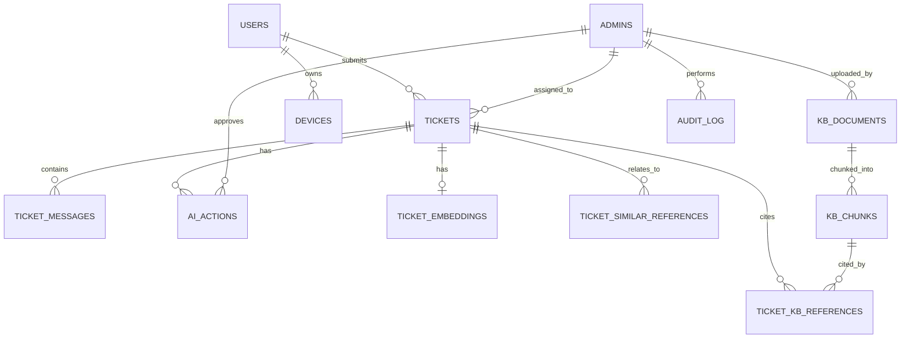

# 03 — Database Design

Engine: **PostgreSQL 16** with the `pgvector` extension enabled (`CREATE EXTENSION vector;`).

## 1. Entity-Relationship Overview

## 2. Tables

### `users`
Students/employees. Never authenticate; identified purely by email.

| Column | Type | Notes |
|---|---|---|
| id | uuid PK | |
| email | citext UNIQUE NOT NULL | case-insensitive |
| name | text | nullable until known |
| department | text | |
| role | text | e.g. `student`, `staff`, `faculty` |
| account_status | text | `active`, `suspended`, `disabled` — mirrors real IT system state, updated by sensitive tools |
| is_unverified | boolean DEFAULT false | true if created from an unrecognized inbound sender (OQ-1) |
| created_at | timestamptz | |
| updated_at | timestamptz | |

### `devices`
| Column | Type | Notes |
|---|---|---|
| id | uuid PK | |
| user_id | uuid FK → users | |
| device_type | text | laptop, phone, desktop |
| os | text | Windows, macOS, iOS, Android, Linux |
| os_version | text | |
| status | text | `active`, `inactive`, `flagged` |
| last_seen_at | timestamptz | nullable |
| created_at | timestamptz | |

### `admins`
| Column | Type | Notes |
|---|---|---|
| id | uuid PK | |
| email | citext UNIQUE NOT NULL | |
| name | text | |
| password_hash | text | argon2 |
| role | text | `admin`, `superadmin` |
| created_at | timestamptz | |

### `tickets`
| Column | Type | Notes |
|---|---|---|
| id | uuid PK | |
| ticket_number | serial UNIQUE | human-friendly `#401` display |
| user_id | uuid FK → users | |
| subject | text | |
| category | text | e.g. `VPN`, `WiFi`, `Password`, `Software`, `Hardware`, `Account`, `Other` |
| priority | text | `low`, `medium`, `high`, `urgent` |
| status | text | `New`, `AI Investigating`, `Waiting for User`, `Waiting for Admin`, `In Progress`, `Resolved`, `Escalated`, `Closed` |
| ai_diagnosis | text | nullable |
| ai_confidence | text \| numeric | store as numeric 0–1 for sorting/filtering (display bucketed as Low/Med/High) |
| assigned_admin_id | uuid FK → admins | nullable |
| resolution_summary | text | nullable |
| created_at | timestamptz | |
| updated_at | timestamptz | |
| resolved_at | timestamptz | nullable |

Indexes: `(status)`, `(user_id)`, `(assigned_admin_id)`, `(category)`, `(created_at desc)`.

### `ticket_messages`
Unified conversation: inbound student email, outbound replies (from AI or admin, sent by
whichever channel), and internal admin notes — one chronological stream per ticket
(FR-4, FR-17, FR-17a, FR-17b).

| Column | Type | Notes |
|---|---|---|
| id | uuid PK | |
| ticket_id | uuid FK → tickets | |
| type | text | `inbound_email`, `outbound_email`, `internal_note` — **direction**, not who sent it |
| channel | text | nullable. `email` for anything that travelled as an email (student inbound, AI outbound, admin's direct-email reply); `portal` for a reply an admin composed in the dashboard UI. Null for `internal_note` (portal-only by definition). |
| author_user_id | uuid FK → users | nullable (set for inbound student email) |
| author_admin_id | uuid FK → admins | nullable (set whenever an admin authored the message — portal reply, direct-email reply, or internal note) |
| author_is_ai | boolean DEFAULT false | true when the AI composed the outbound reply |
| subject | text | nullable (notes have none) |
| body_text | text | |
| body_html | text | nullable |
| message_id | text | nullable, provider's `Message-ID` header, UNIQUE when present |
| in_reply_to | text | nullable, header used for threading |
| raw_headers | jsonb | nullable |
| created_at | timestamptz | |

Indexes: `(ticket_id, created_at)`, UNIQUE `(message_id)` where not null.

**How the two admin reply paths land in the same table:**

- **Portal reply** — admin types in the dashboard. The API inserts the row directly:
  `type=outbound_email, channel=portal, author_admin_id=<admin>`, then hands it to the
  outbound-email job to actually send it to the student.
- **Direct email reply** — admin replies from their own mail client, with the support alias still
  on the thread (e.g. reply-all). This arrives at the *same* inbound webhook a student's email
  would. The ingestion worker must therefore check the `From` address against `admins` **before**
  assuming it's a student:
  - `From` matches an `admins.email` → insert `type=outbound_email, channel=email,
    author_admin_id=<admin>`, attach to the existing ticket via `in_reply_to`/`References`, and
    update `tickets.status = Waiting for User`. Do **not** enqueue another `agent.run` — a human
    has already answered, so the AI shouldn't also reply on top of it.
  - `From` matches a `users.email` (or is unrecognized) → the existing student-inbound path:
    `type=inbound_email, channel=email, author_user_id=<user>`, `tickets.status = AI Investigating`
    (or `Waiting for Admin` if the ticket is already escalated), enqueue `agent.run`.

This is why `channel` and `type` are separate columns: `type` says which direction the message
flows in a ticket's conversation; `channel` says which door it came through. An admin's reply is
always `type=outbound_email` whether it came via `portal` or `email` — the dashboard renders both
identically in the thread, with a small badge showing which channel was used, purely for
admin transparency.

### `kb_documents`
| Column | Type | Notes |
|---|---|---|
| id | uuid PK | |
| name | text | |
| category | text | matches project.md §6 categories |
| storage_path | text | S3/MinIO key |
| file_type | text | pdf, docx, md, txt |
| version | int DEFAULT 1 | |
| status | text | `processing`, `ready`, `failed` |
| num_chunks | int DEFAULT 0 | |
| uploaded_by_admin_id | uuid FK → admins | |
| checksum | text | dedupe/detect re-upload |
| created_at | timestamptz | |
| updated_at | timestamptz | |

### `kb_chunks`
| Column | Type | Notes |
|---|---|---|
| id | uuid PK | |
| document_id | uuid FK → kb_documents | |
| chunk_index | int | order within document |
| content | text | |
| token_count | int | |
| embedding | vector(1024) | dimension depends on embedding model chosen (`05-tech-stack.md`) |
| metadata | jsonb | page number, section heading, etc. |
| created_at | timestamptz | |

Index: `CREATE INDEX ON kb_chunks USING hnsw (embedding vector_cosine_ops);`

### `ticket_embeddings`
One row per ticket, embedding of issue text (+ resolution once resolved), for
`search_similar_tickets()` (FR-10).

| Column | Type | Notes |
|---|---|---|
| ticket_id | uuid PK, FK → tickets | |
| content_summary | text | text that was embedded (issue + resolution) |
| embedding | vector(1024) | recomputed when ticket is resolved/updated |
| updated_at | timestamptz | |

Index: `CREATE INDEX ON ticket_embeddings USING hnsw (embedding vector_cosine_ops);`

### `ticket_kb_references`
Join table: which KB chunks were used for a ticket's diagnosis/response (FR-8).

| Column | Type | Notes |
|---|---|---|
| id | uuid PK | |
| ticket_id | uuid FK → tickets | |
| kb_chunk_id | uuid FK → kb_chunks | |
| relevance_score | numeric | similarity score at retrieval time |
| created_at | timestamptz | |

### `ticket_similar_references`
Join table: which other tickets were surfaced as similar historical incidents (FR-9, FR-10).

| Column | Type | Notes |
|---|---|---|
| id | uuid PK | |
| ticket_id | uuid FK → tickets | the ticket being investigated |
| related_ticket_id | uuid FK → tickets | the historical match |
| similarity_score | numeric | |
| relation_type | text | `same_user_history` or `cross_user_similar` |
| created_at | timestamptz | |

### `ai_actions`
The audit trail from project.md §11, and the mechanism for the approval workflow (§10).

| Column | Type | Notes |
|---|---|---|
| id | uuid PK | |
| ticket_id | uuid FK → tickets | |
| tool_name | text | one of the tool contracts in `04-api-design.md` §3 |
| classification | text | `safe` or `sensitive` — copied from the tool registry at call time (immutable audit fact) |
| input_payload | jsonb | validated tool input |
| output_payload | jsonb | nullable until executed |
| reasoning | text | agent's stated rationale for this action |
| sources | jsonb | KB doc ids / ticket ids consulted, for quick display without extra joins |
| status | text | `proposed`, `executed`, `pending_approval`, `approved`, `rejected`, `failed` |
| requires_approval | boolean | derived from `classification = 'sensitive'` |
| decided_by_admin_id | uuid FK → admins | nullable, set on approve/reject |
| decision_reason | text | nullable, admin's reason on reject |
| created_at | timestamptz | |
| decided_at | timestamptz | nullable |
| executed_at | timestamptz | nullable |

Indexes: `(ticket_id, created_at)`, `(status)` (for the pending-approvals queue, FR-18).

### `audit_log`
Admin-side actions not already captured by `ai_actions` (FR-22): login, KB document
upload/delete, manual ticket reassignment, admin account changes.

| Column | Type | Notes |
|---|---|---|
| id | uuid PK | |
| admin_id | uuid FK → admins | |
| action | text | e.g. `login`, `kb_document_upload`, `ticket_reassign` |
| target_type | text | `ticket`, `kb_document`, `admin`, etc. |
| target_id | uuid | |
| metadata | jsonb | |
| created_at | timestamptz | |

### `service_status` (supports `check_service_status()`)
Simple table an admin can update, or that a monitoring integration writes to later.

| Column | Type | Notes |
|---|---|---|
| service_name | text PK | `VPN`, `WiFi`, `Email`, `SSO`, ... |
| status | text | `operational`, `degraded`, `outage` |
| last_checked_at | timestamptz | |
| notes | text | nullable |

## 3. Notes on pgvector Usage

- Two independent vector spaces exist (`kb_chunks.embedding`, `ticket_embeddings.embedding`) —
  do not conflate KB similarity with ticket similarity even though they may use the same embedding
  model; keep separate columns/indexes since query patterns differ (KB search always filters by
  `kb_documents.status = 'ready'`; ticket search typically filters by `category` and `status`).
- Use `vector_cosine_ops` for both, matching typical embedding-model similarity semantics.
- Re-embed `ticket_embeddings` when a ticket's resolution is added/changed, since the resolution
  text is often the most valuable part of the embedding for future matches (per the "expired VPN
  certificate → renewed" examples in the spec).

## 4. Retention / Deletion

Per NFR-7, no hard-delete of `tickets`, `ticket_messages`, or `ai_actions` — add a
`deleted_at`/archival mechanism only if legally required later; default is retain-and-archive, not
purge.
